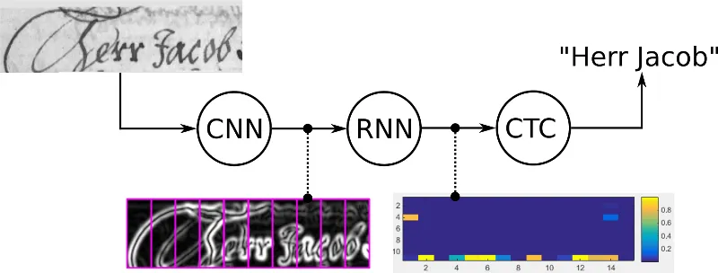
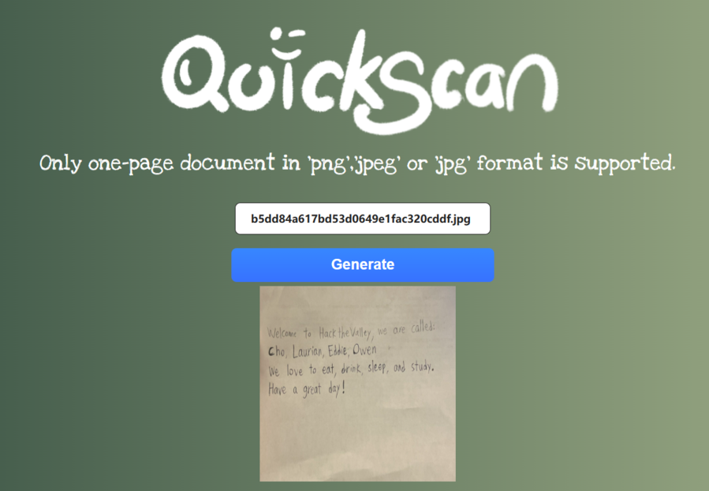

# QuickScan-Handwritten-Paragraph-Recognition
> OpenCV and TensorFlow for model deployment, combined with Flask for web 
> development and HTML,CSS for front-end work, to enable Handwritten Paragraph 
> Recognition with web-based accessibility.

[](https://github.com/FywOo02/Boston-House-Pricing-Forecast)


## Introduction to QuickScan
-   QuickScan is a powerful web application designed to swiftly convert handwritten text into digital text. This application utilizes a blend of front-end technologies such as HTML and CSS, combined with robust back-end tools like Python, Flask, TensorFlow, and OpenCV.
###Usage To utilize this web application, follow these simple steps:

1. Upload: Start by uploading a jpg file containing the handwritten text you wish to convert.
2. Generate: Press the "Generate" button to initiate the conversion process.
3. Magic Unveiled: Witness the magic as QuickScan transforms the handwritten text into digital format.

Enjoy the seamless experience of converting handwritten text to digital effortlessly with QuickScan!

<div align=center>
 
</div>

## Machine Learning Model Architecture
- The pipeline consists of 2 steps: Image Segmentation and line prediction.
### Image Segmentation
- The input consists of a jpg image with dimensions width x height x 3 channel (RGB), and it contains paragraph(s) of handwritten text.
<div align=center>
 
</div>

- After reading the input image, a list of contours/boundaries are calculated for each line in the paragraph(s) using techniques from OpenCV.
- The input image is then cropped based on the contours, which produces lines of handwritten text, then saved as new jpg files, and their file paths are saved to a .csv file as output.


<div align=center>

</div>
    
### Sentence Line Prediction
- The input of this section is taken from the .csv output of image segmentation.
- The model will predict the line of handwritten text from each row of the .csv file.
- To predict the handwritten text, we trained a machine learning model with TensorFlow.
  - We used two neural networks, CNN, which is used to extract key features from the images and RNN, which is responsible for processing the extracted features and make predictions.
  - Also, by utilizing CTC(Connectionist Temporal Classification) as our loss function, the model will update to reduce the disparity between the estimated values and the actual labels.
- The recognized text from model is returned as prediction output.


<div align=center>

</div>

## Web Design

<div align=center>

</div>


## How can I use the QuickScan?
1. Install the related libraries
> This project uses deep learning related libraries, go check them out if 
> you want to modify the code
```
pip install mltu
pip install numpy
pip install matplotlib
pip install pandas
pip install opencv-python
pip install Flask
pip install pillow
pip install tqdm
```
2. Clone the original files in git bash
```
git clone https://github.com/FywOo02/ScriptScan-Handwritten-Paragraph-Recognition.git
```
3. Run the start.py, and try that!
```
python start.py
```


## File Descriptions
```
├── project_src
├── readme_file_src
├── Environments.txt # environments needed to run the program
├── LICENSE.txt 
├── README.md
├── start.py # @@place to start the recognition@@
```

## Contributor
<a href="https://github.com/LL-Laurian">
  
</a>

<a href="https://github.com/FywOo02">
  
</a>

<a href="https://github.com/Eyang0612">
  
</a>

<a href="https://github.com/owensun2004">
  
</a>

## Special Assist
<a href="https://github.com/liderrick616">
  
</a>

## License
[MIT](https://github.com/FywOo02/Handwritten-Digit-Recognizer-With-GUI/blob/main/LICENSE) © Involution Group
